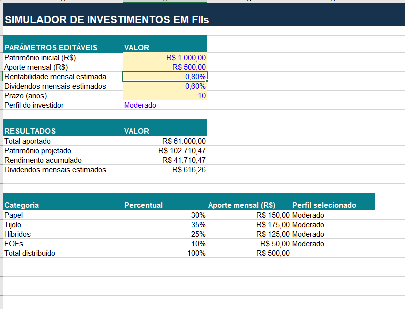
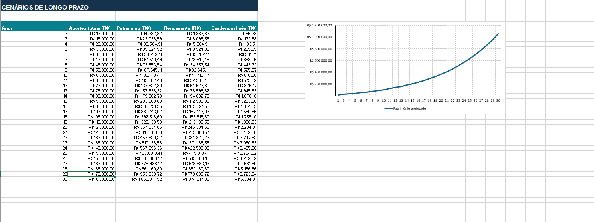
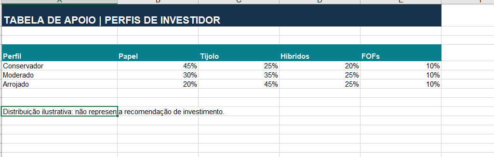
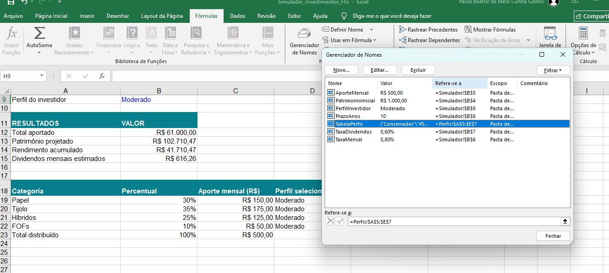

# 📊 Simulador de Investimentos em Fundos Imobiliários (FIIs)

Projeto educacional desenvolvido em **Microsoft Excel** para simular a evolução do patrimônio por meio de aportes mensais, rentabilidade composta e estimativas de dividendos. O desafio contempla **VF**, **PROCV**, intervalos nomeados e cenários de **2 a 30 anos**.

## Funcionalidades

- Configuração de patrimônio inicial, aporte mensal, rentabilidade mensal, dividendos, prazo e perfil.
- Cálculo do valor futuro com `VF`.
- Projeção de aportes, rendimentos e dividendos em diferentes horizontes.
- Distribuição do aporte entre categorias de FIIs por perfil com `PROCV` e tabela de apoio.
- Gráfico de evolução patrimonial.
- Intervalos nomeados para facilitar leitura e manutenção das fórmulas.

## Capturas de tela

### 1. Simulador

### 2. Cenários de longo prazo

### 3. Perfis de investidor

### 4. Intervalos nomeados

## Como utilizar

1. Baixe [Simulador_Investimentos_FIIs.xlsx](Simulador_Investimentos_FIIs.xlsx).
2. Abra o arquivo no Microsoft Excel.
3. Na aba **Simulador**, altere os parâmetros editáveis.
4. Escolha um perfil de investidor e confira a distribuição dos aportes.
5. Consulte a aba **Cenarios** para visualizar os prazos de 2 a 30 anos.
6. Consulte as abas **Perfis** e **Guia** para informações complementares.

## Fórmulas principais

- **Total aportado:** `=PatrimonioInicial+AporteMensal*PrazoAnos*12`
- **Patrimônio projetado:** `=VF(TaxaMensal;PrazoAnos*12;-AporteMensal;-PatrimonioInicial;0)`
- **Rendimento acumulado:** `=B13-B12`
- **Dividendos mensais estimados:** `=B13*TaxaDividendos`
- **Percentual por categoria:** `=PROCV(PerfilInvestidor;TabelaPerfis;2;FALSO)` (índices 2 a 5)

## Documentação

- [Explicação dos cálculos](docs/Explicacao_dos_Calculos.md)
- [Passo a passo do desafio](docs/Passo_a_Passo.md)

## Premissas e limitações

Os resultados são **simulações ilustrativas**, não previsões garantidas. O modelo utiliza rentabilidade mensal constante e aportes no fim de cada mês; não considera impostos, custos, inflação nem volatilidade. A taxa de dividendos é uma estimativa sobre o patrimônio projetado, e não deve ser somada novamente ao retorno para evitar dupla contagem. As alocações por perfil são exemplos educacionais, não recomendações de investimento.

## Tecnologias

Microsoft Excel, funções financeiras e de busca, tabelas de apoio, intervalos nomeados, gráficos e GitHub.
